# Dimension reduction
The following figure shows the plot of PCA and PCoA (Principal Coordinate Analysis). These methods allow reduction in feature space (microbial species) for visualization and subsequent analysis purposes.

# PCA components

 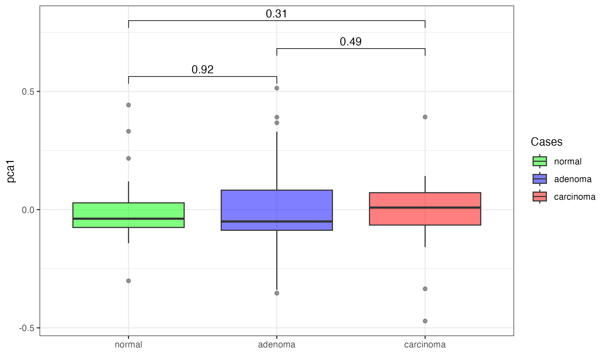{.width=50} 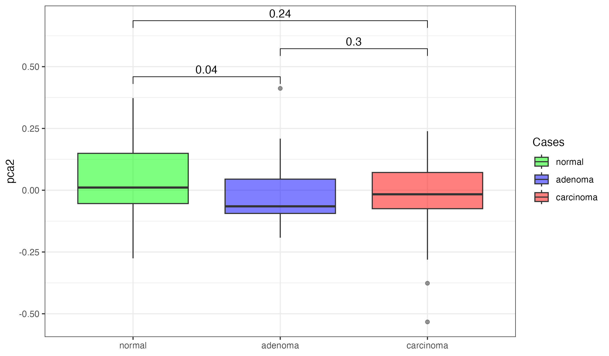{.width=70}
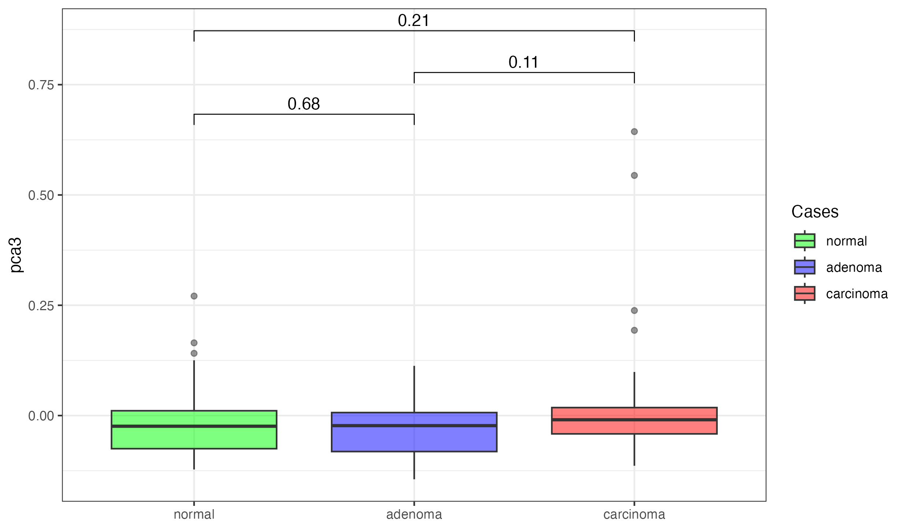 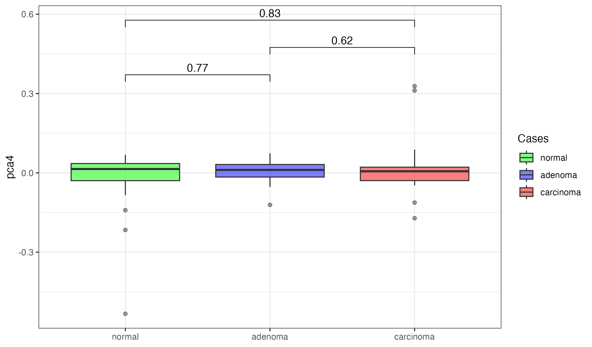 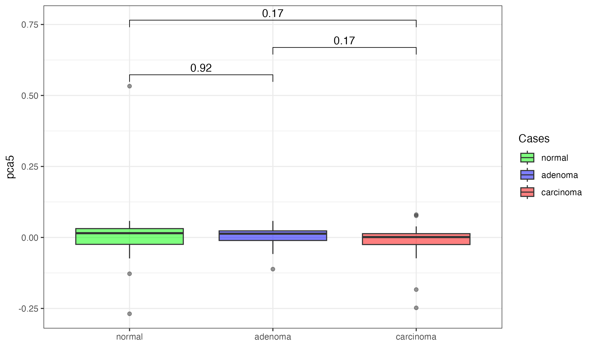
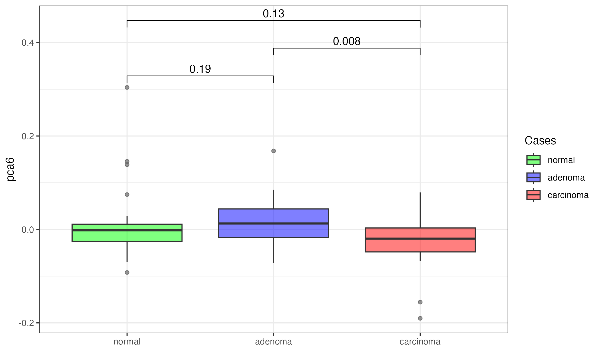
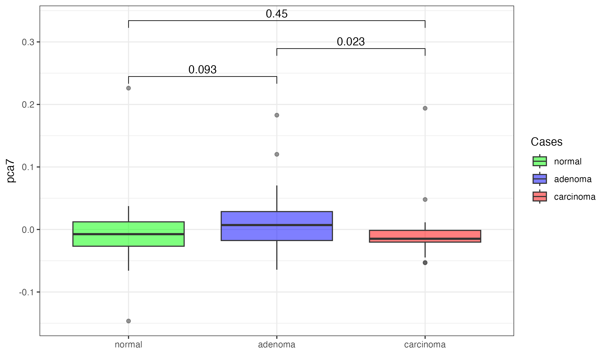
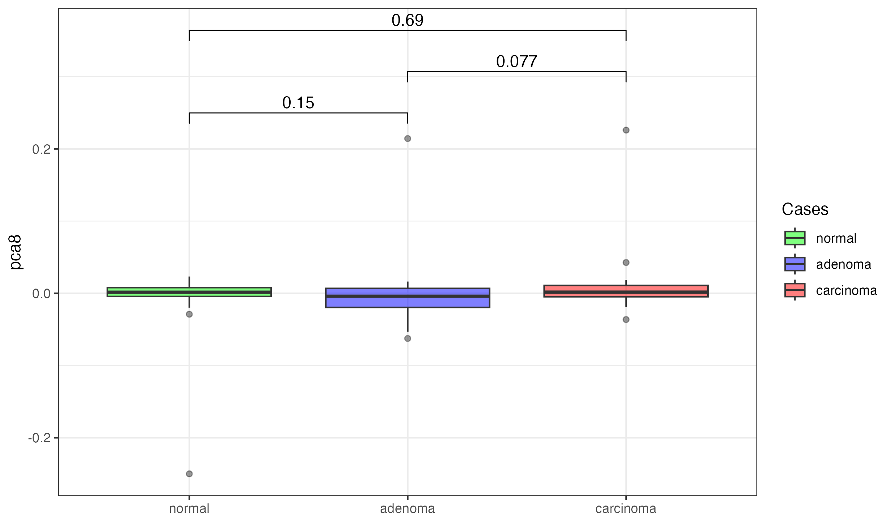
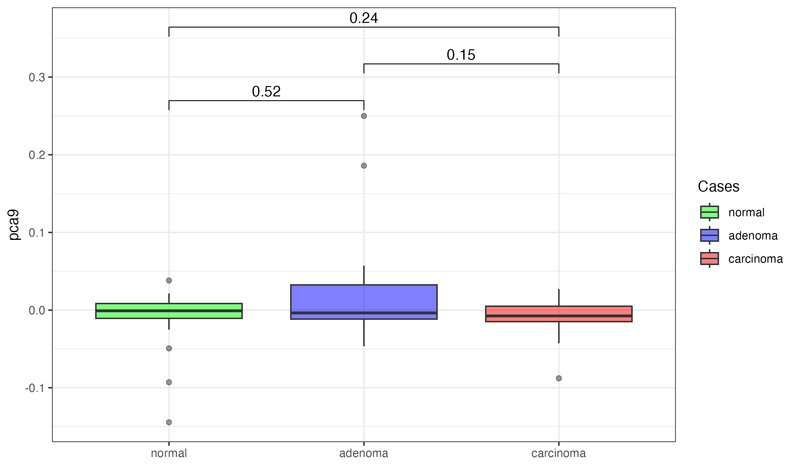

## PCoA
The following figures are from Principal Coordinate Analysis (PCoA).
### Bray-Curtis distance. 

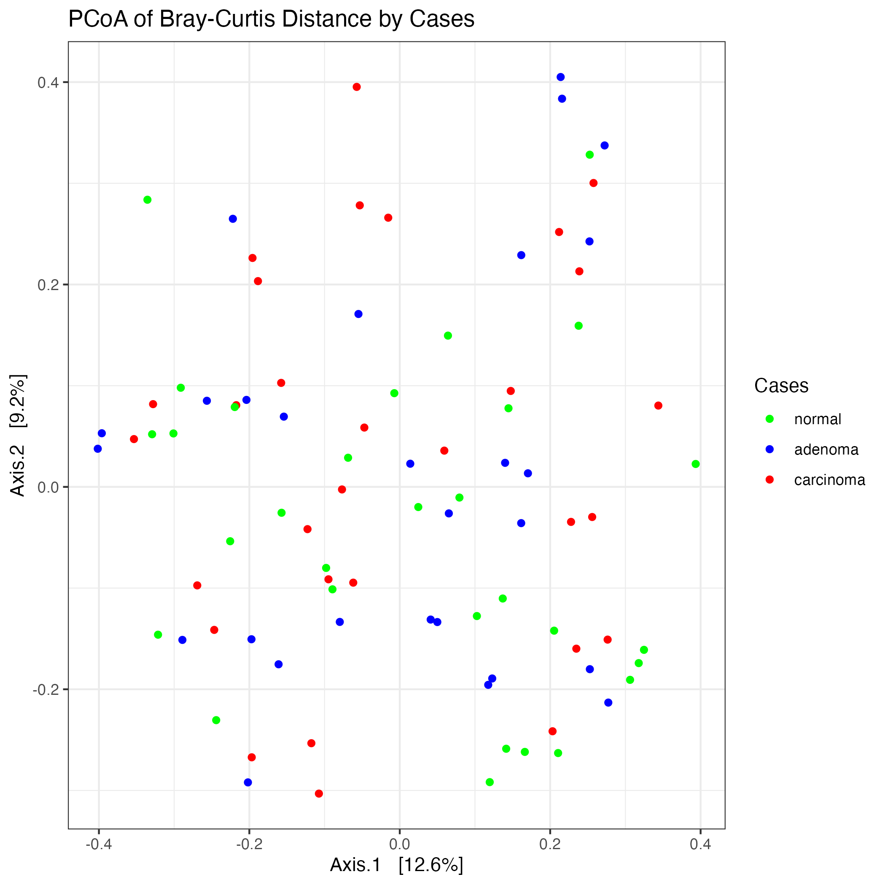

###  Unifrac distance
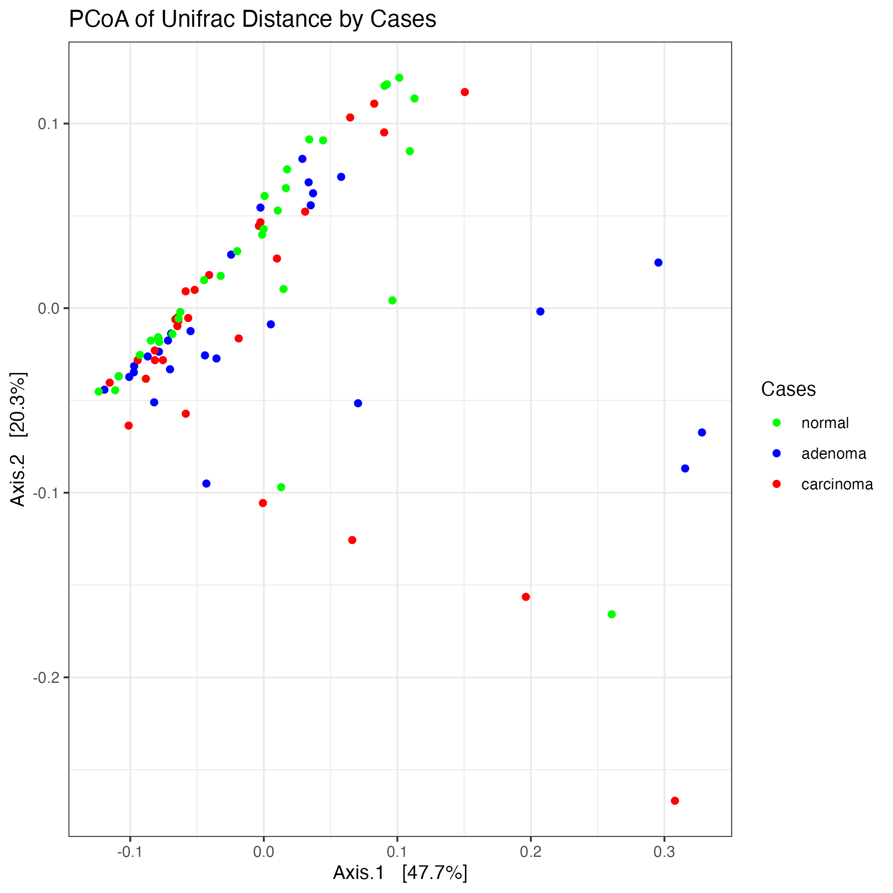