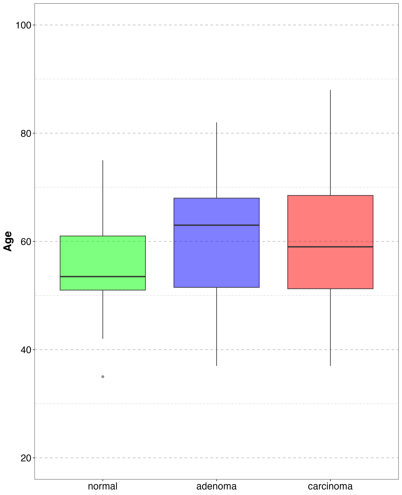
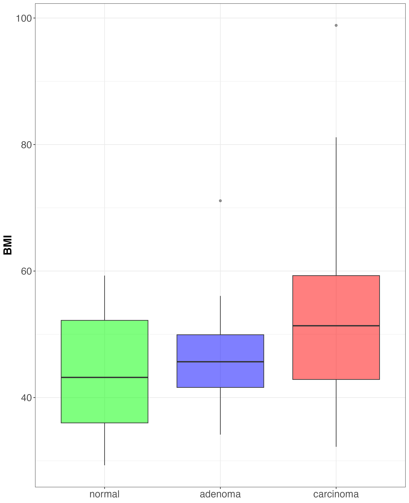
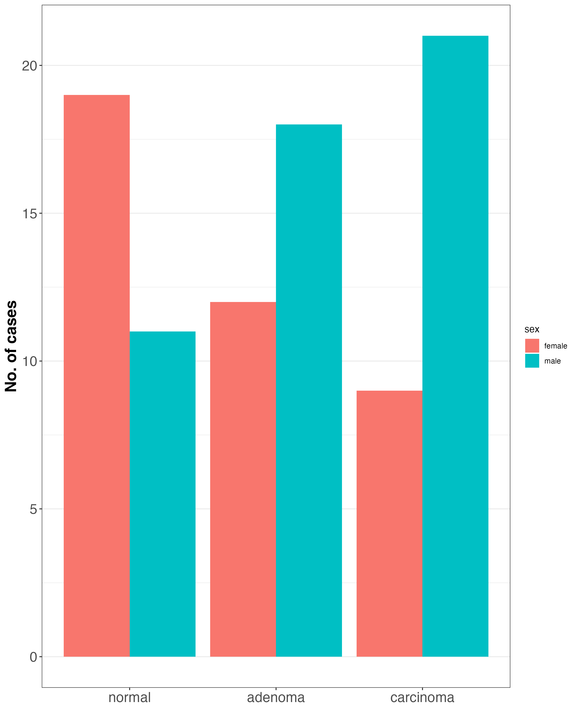

# Host characteristics
This is the first exploration step which looks at host characteristics across cases under study (i.e., healthy, adenoma, carcinoma). We explore characteristics such as age, BMI and sex with the goal to identify any potential relationships with colon cancer.

## Age
This figure shows age distribution among healthy, adenoma and carcinoma cases.
!!! note "Age"
    **CRC** patients are slightly **older** than healthy ones.

    

<figure markdown="span">
  {: style="height:450px;width:400px" align=right} 
  <figcaption>Age distribution</figcaption>
</figure>

## BMI
The figure below shows BMI (Body-Mass Index) distribution among different classes.

!!! note "BMI"
    There is an **increase in BMI** for CRC compared to healthy and adenoma cases.

<figure markdown="span">
{: style="height:450px;width:400px" align=right} 
  <figcaption>Body-Mass Index distribution</figcaption>
</figure>

## Sex
The sex distribution among health, adenoma and CRC cases is presented in the below figure.

!!! note "Gender"
    There are **more males** with CRC than females.

<figure markdown="span">
{: style="height:550px;width:500px" align=right} 
  <figcaption>Sex distribution</figcaption>
</figure>