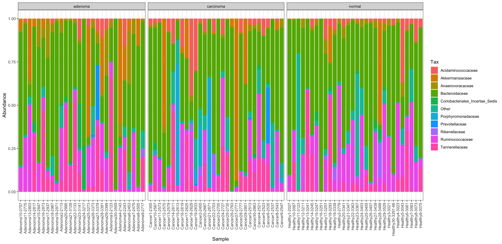
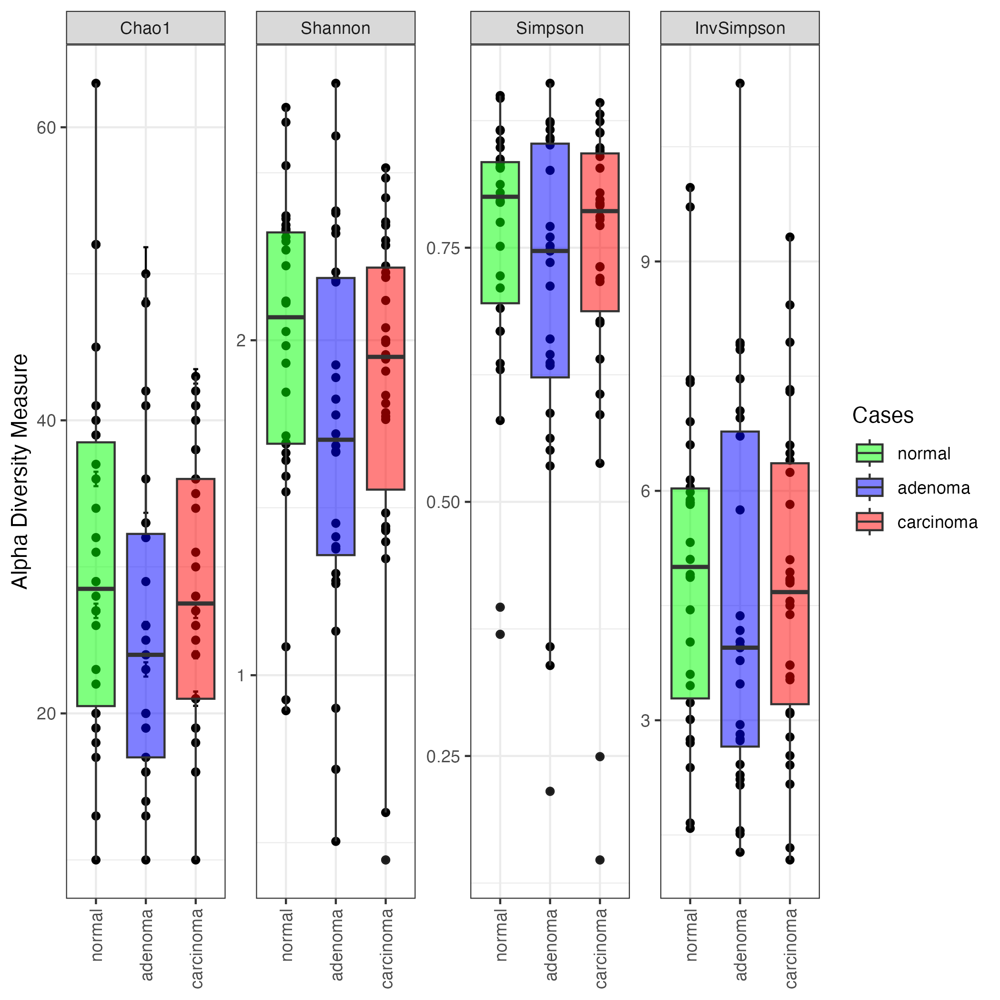
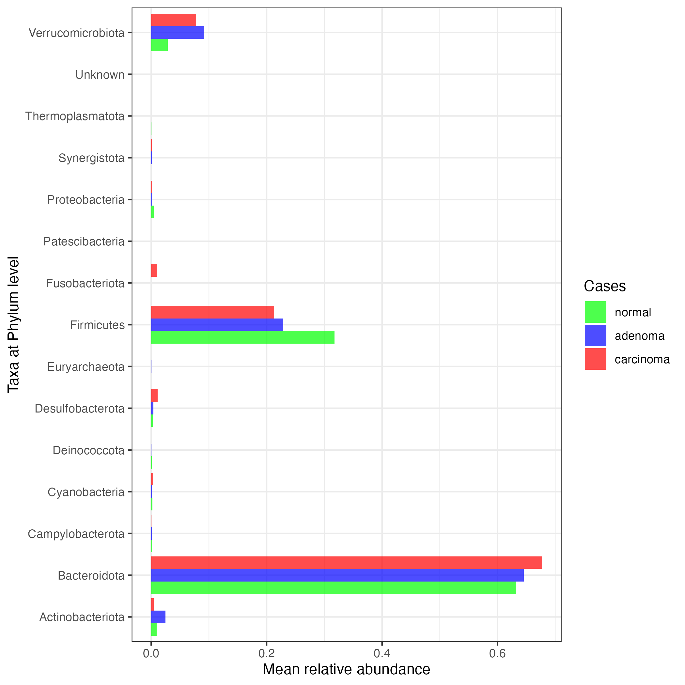
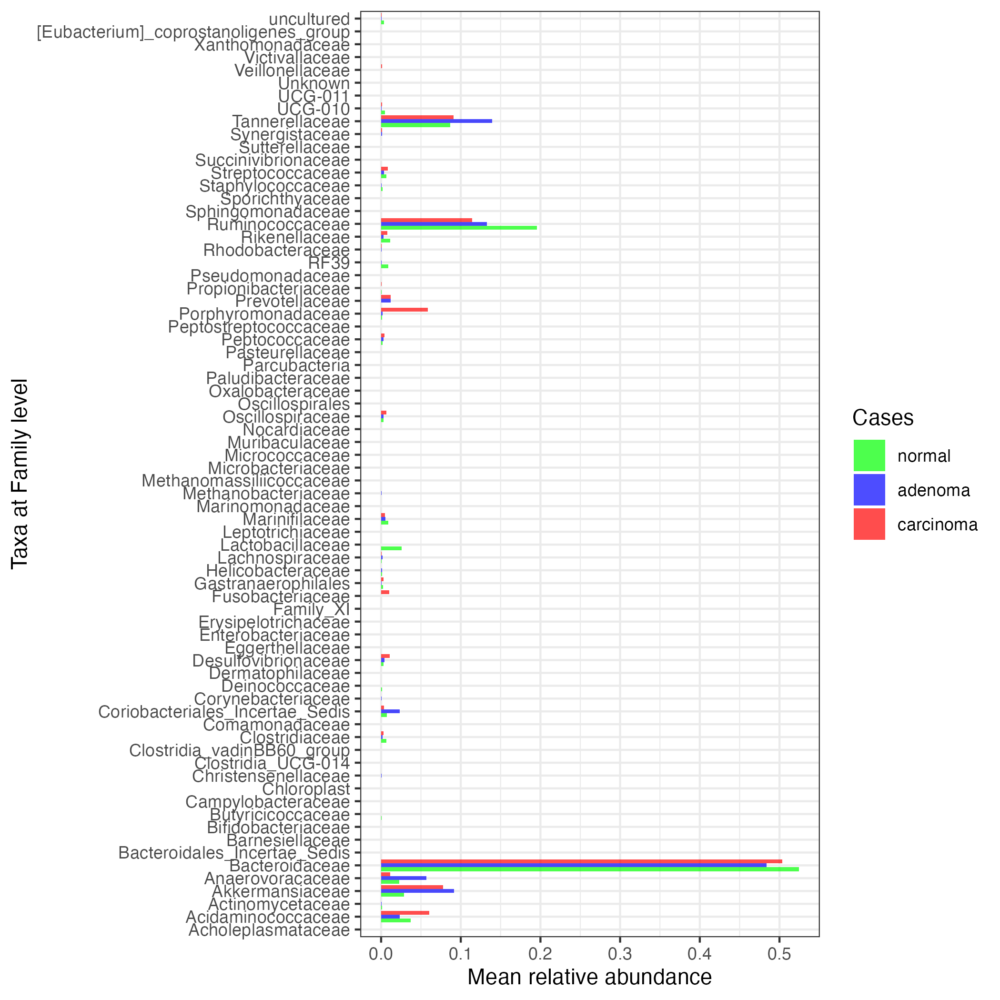
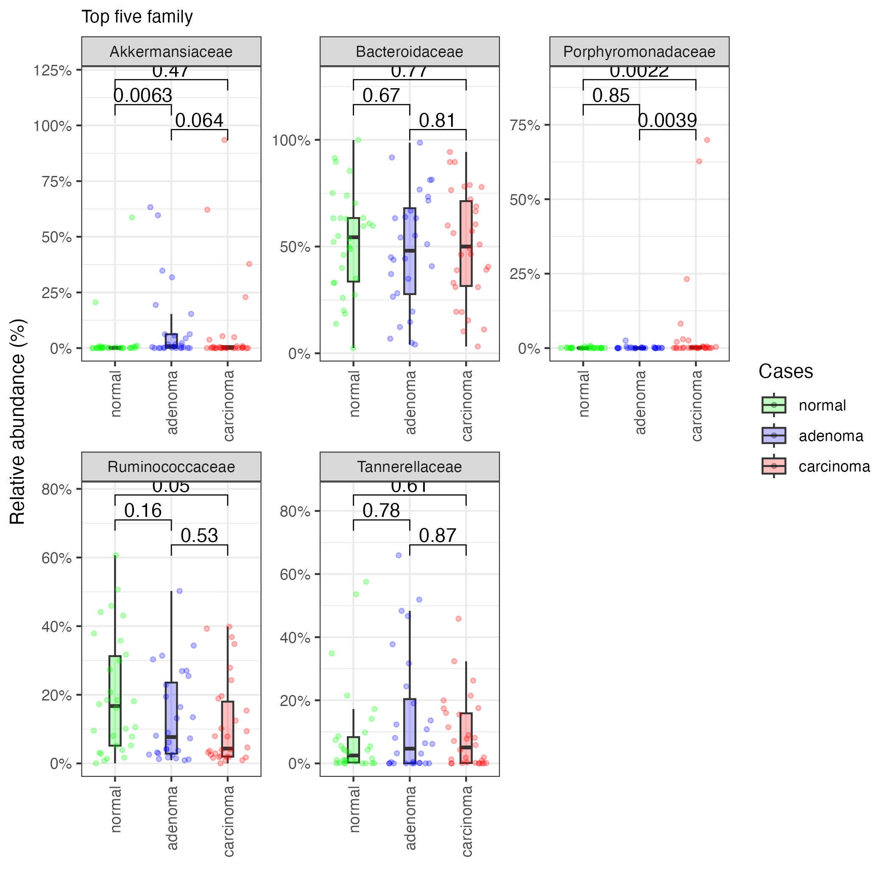

# Microbial composition
This step visualize microbial compositions found in the sample across different cases. This visualization offers the first insights into types of microbiome present in the sample and whether there is any differences in the compositions.

The below figure shows composition of top 10 families in the sample across different groups.

## Alpha diversity
Alpha diversity measures provide insights into richness and evenness of species in a community. There are several measures available for computing alpha diversity. For example, Shannon, Chao1, Simpson, etc. Read more about alpha diversity [here](https://medium.com/@pankajchejara/what-is-alpha-diversity-and-how-to-measure-it-72acd6bce4e3)

We will use those measures to identify patterns of potential associations between alpha diversity and colorectal cancer.

The figure below shows four alpha diversity measuers (i.e., Cho1, Shannon, Simpson, InvSimpson) for normal, adenoma, and carcinoma cases of colorectal cancer.

!!! tip "Alpha diversity"
    Healthy individuals exhibit relatively higher alpha diversity compared to adenoma and carcinoma patients, with the difference being more pronounced between normal and adenoma groups.

## Microbial species at Phylum level

!!! tip "Abundant phylum"
    Bacteroidota, Firmicutes, and Verrucomicrobiota are the most abundance phylums present in the samples.

## Microbial species at Family level

## Top-5 Families
The following figures show distribution of top-5 families across healthy, adenoma and carcinoma patients. The figures also show statistical significance of differences between groups in terms of relative abundance of five microbiome families (Wilcoxon rank test).

!!! tip "Ruminococcaceae"
    There is statistical significant differences between healthy and carcinoma patients in terms of relative abundance of Ruminococcaceae.

